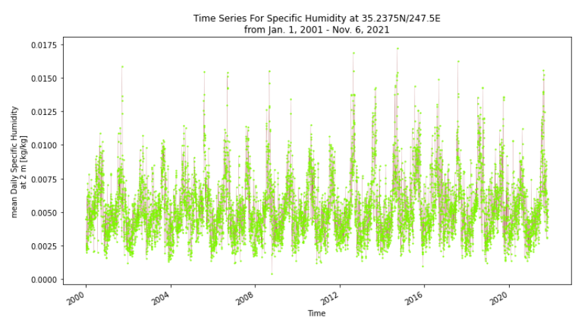

# David Morales, 11/7/2021, HW11
_____
### Grade
3/3 - Great job. I like your rational for looking into specific humidity!
_____

### Rationale:
1. The data I used to generate my forecast this week still included the streamflow data from the USGS stream gauge. I find this to be the best, most easily incorporated data thus far.
   
2. This week I added the specific humidity from the NCEP Reanalysis Daily Averages dataset in order to understand how the humidity of the area might affect the flow of the river. Evaporation rates are expected to increase when humidity is low and I thought it would be interesting to understand how the specific humidity would change in the area around the stream gauge. In my research, I've learned that the Verde River is largely supplied from groundwater flows and so I felt that learning about the subtractive effect of humidity would be most beneficial.

3. The spatial resolution of the data extends from lat (35.24N to 33.33N) and lon (247.5E to 249.4E). The temporal extent is from Jan. 1, 2000 to Nov. 1, 2021. I felt this large range would be necessary to identify any trends that might have developed in the last two decades.

4. My approach to extracting and aggregating the data into something useful centered around the keywords provided by the HDF metadata. It is incredibly useful to be able to reference this metadata at any time in the process as it maintains an acute awareness of the data.
   
  
