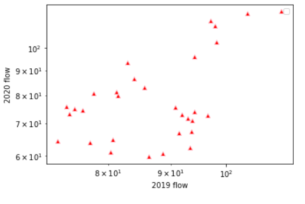

# David Morales, 10/04/2021, HW6

____
## Grade
3/3: Awesome job! I really like the logic behind your graphs and how you are using them to inform your decision making. Just remember to include your final prediciton next time too. 
___

## Rationale:
1. 
  
This line graph was made using all of the daily flow values from January 1, 2015 to October 10, 2020 using 'datetime' as the x axis and the flow values along the y axis. I decided to start off with this graph so that I could understand the seasonality of flows. 2015 was chosen as my start year because using 2010 crammed too much data to identify patterns. Something happened in early 2018 that resulted in lower flow, not sure what but certainly interesting! Understanding the pattern of flow reassured my confidence in chosing an estimate based on historical flows.

2. 
  
The box plot I used focused on the daily flow avarages for the week 1 forecast dates since 2010. This, unlike the line graph above, handles large amounts of data in small spaces really well. Interestingly, other than Oct. 4, 7 & 8 historical flows, the median flow value seems to fall closer to the 75 quantile than the 25 quantile. And in Oct. 5 & 10, the median buts right up against the 75 quantile. In all of the dates except for Oct. 7, the 100 quantile sits right on top of the 75 quantile which tells me that lower flow values are less reliable and cautioned me against using too low of a value.

3. 
  
This bar graph was made by finding the average flow value of the week Oct. 4-10 since 1989. This was still made using the year as the index and it proved easier for me to use than trying to keep the index as a unique identifier like the original dataframe. It's curious because in the first graph, I saw that 2018 had an unusual flow pattern at the start of the year, but a higher than usual flow average for the forecasted week. The graph seems to undulate with crests and troughs and I wonder if we are moving upward again in weekly flow average.

4. 
  
This line graph serves a similar purpose as the bar graph but instead of looking at a weekly average for the forecast week across years, it plots October flows from the past ten years. Unlike the first line graph, it was easier to look at a longer time from because of cutting out the other data from different months. Again, we see that 2010 and 2020 had surprisingly large flows. Could these be related to 10-year floods?

5. 
  
The scattor plot takes each day's flow value for the year 2020 and 2019 and shows their relationship by plotting it along the a log scale graph. There seems to be three clusters, unfortunately I'm not able to identify which days each marker represents. However, the clusters suggest that there is considerable similarity between the two years.

6. 
  
These two histograms look at flows from the week 1 and week 2 dates since 1989 on a log scale and count the number of occurances. In the week 1 flow, there's a surprising lack of 200cfs flows. I needed to limit the x axis so there are some data points missing, specifically those around 300+cfs. They happened too infrequently and stretched the graph out too far to be necessary for informing my prediction. It's interesting that the week 2 forecast has a more symmetrical spread and a lower count limit. This corresponds to the boxplot graph that showed the close proximity of 100, 75, and 50 quantiles.