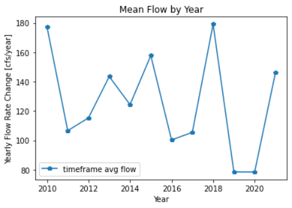
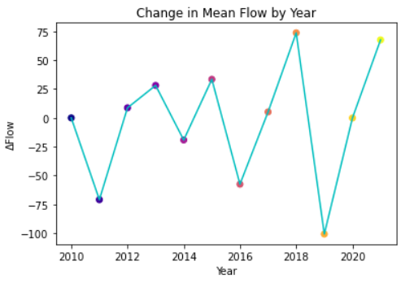
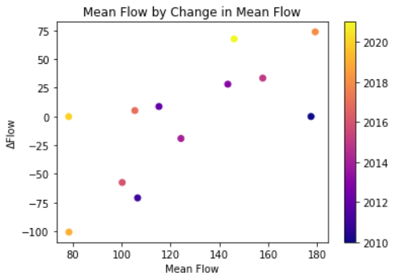

# David Morales, 10/18/21, HW8

## Rationale:

1. I generated my forecasts using the weekly mean flow for the week of Oct. 17-23 since 2010 because of the obvious shift in average flow from 1989-present and 2010-present. I believe that incorporating pre-2010 data  shifts these statistical measures significantly in a way that isn't predicitive with recent history.
2. The three graphs and why I chose them:
    
   
   This graph is meant to show the mean flow of the week Oct. 17-23 for each year since 2010. It's interesting to see that when the flow hits a low point, it tends to remain at a similar mean flow for another year as can be seen from 2011-2012; 2016-2017; and 2019-2020. This lows are then followed by a sharp increase and then another sharp decrease. It's very rare that a high mean flow is followed by another high mean. 

   

   This graph shows the change in mean flow between years. It reflects the slopes between the points in the previous graphs. Because this isn't a climate with steadily changing mean flows, there is no linear increase or decrease in the plot points, instead is seems to reflect destabilizing fluctuations in mean flow differences as the variance grows larger in more recent years.
   
   

   In this third graph, the change in mean flow is plotted against the same year's reported mean flow. It shouldn't be surprising that higher mean flows tend to relate to more extreme values in change of mean flow. Using this graph was important in understanding that increasing variance in flows in more recent years. As can be seen in the colorbar, the more recent dates are not clustered as tightly as earlier years.

3. I added some further comments in my script as per the recommendations of my reviewer and rounded some output to two decimal places to improve readability.
4. I didn't add any timeseries functonality into my script for this week's assignment because this week's To Do List did not mention we would need to incorporate timeseries for this assignment. It's not a valid excuse, but that's my reason. I made the edits to my script as per my reviewer's criticism but I didn't see the need for timeseries functionality until this morning; I apologize.
5. I am proud of using the various functions in my code. It's incredible to think that creating them is this simple and it really does expedite the ease with which I can analyze various timeframes and create graphs at will!