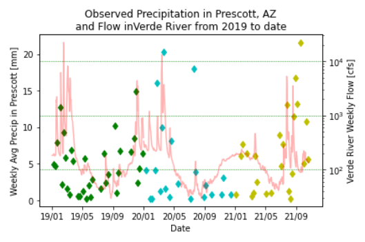

# David Morales, 10/25/2021, HW9

____________
## Grade:
**2.5/3:** Nice work. I like the graph you generated. For the second graph I was looking for anything you looked at that helped you make your guess (e.g. a plot of flow values this week). I just subtracted 0.5 for the missing last graph. 
____________

## Rationale:

I decided to guess this time for my forecast values. Despite relying on data to calculate historic weekly means for the past seven or so weeks, I remain in last. That being said, I looked at the graph that I generated concerning observed rainfall near the headwaters of the Verde River and the observed weekly flow of the Verde River. It seems that flow increases after Oct. while rainfall varies. 

The dataset I added is the precip_accum_24_hour variable from KPRC weather station on Love Field in Prescott, AZ. I chose it because it sits within the watershed near the headwaters of the Verde River. Though the river is formed by springs in Chino Valley near Paulden, runoff must still affect the downstream flow. I obtained the information on the weather station from Synoptic Metadata Explorer and then pulled the data from Mesonet's API. I utilized the RESTful API with Week9 starter code after obtaining my token and finding the Station id from Synoptic's website.  

  

I'm not sure what a plot illustrating my forecast values entails, although in the graph above, I simply estimated what the forecast values would be in the hopes that an estimation would serve me better than a calculated forecast.
