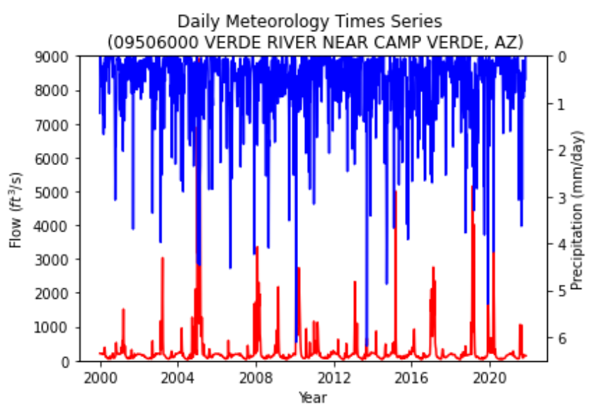
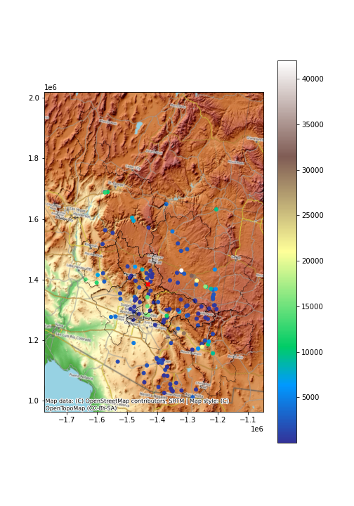

# Team Xueyan, Kevin, and David (XKD), HW12, 11/14/21

## Rationale:
1. Streamflow forecast:
   - One-week forecast: 139 cfs
   - Two-week forecast: 89 cfs

2. The team met in class to determine what features would be included in the forecast code. David downloaded the netCDF data using the lat/lon boundaries for the HUC4 1506 watershed. Xueyan incorporated the streamflow data pull from the USGS website and created the linear regression model. Xueyan and David collaborated on forecasted precipitation data to use in the linear regression model. David then converted the linear regression model into a function to facilitate streamflow forecast and formatted the .py file. Xueyan also generated a beautiful twin_x graph to display observed flow and precipitation since 2000. Kevin incorporated the map, showing the HUC6 watershed boundary and the topography of the surrounding landscape around Arizona and the Verde River. A point was added to showcase the position of the stream gauge in Camp Verde (identified by a bright red 'X') and other points were added to showcase the surrounding stream gages, color sorted using the terrain color map by their drainage per square kilometer. David cleaned, commentted, and reformatted code.

  

